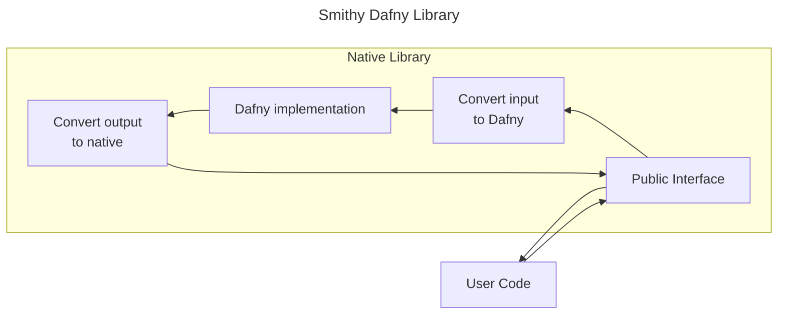
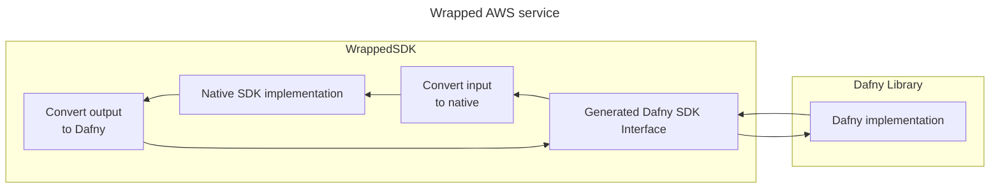
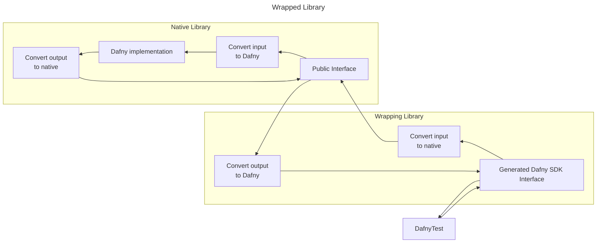
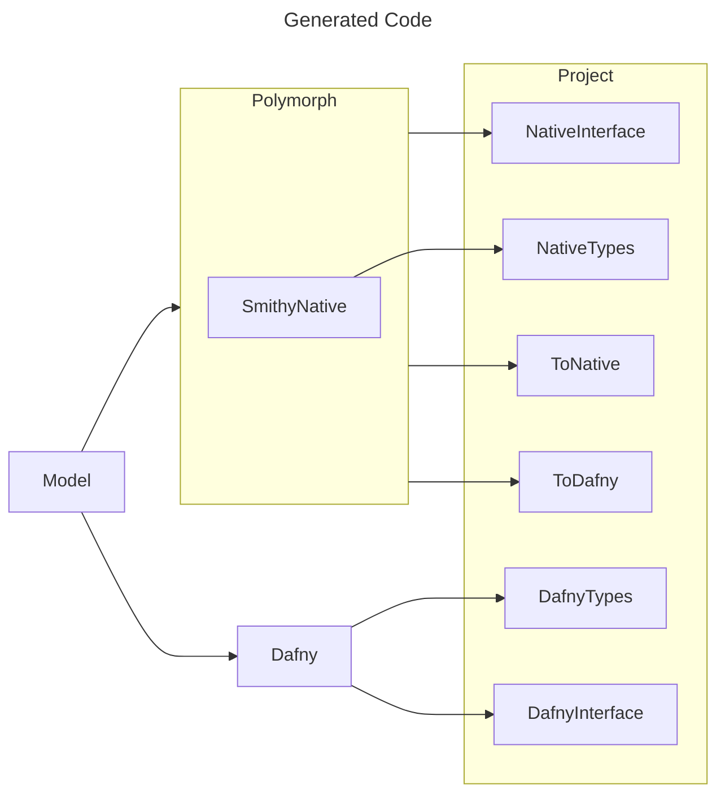
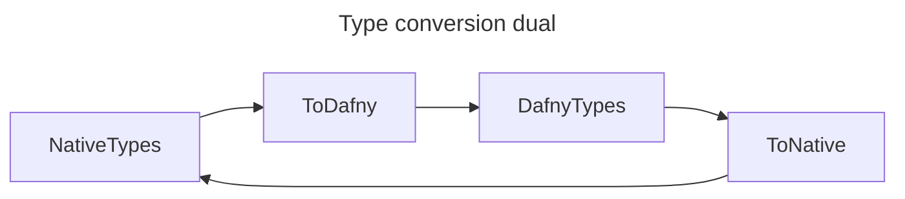
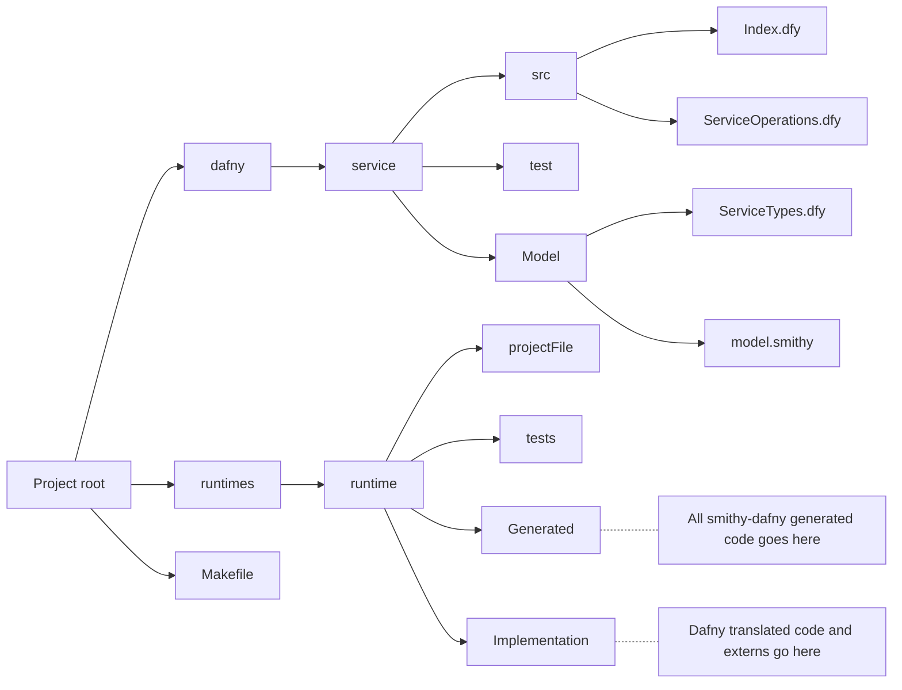
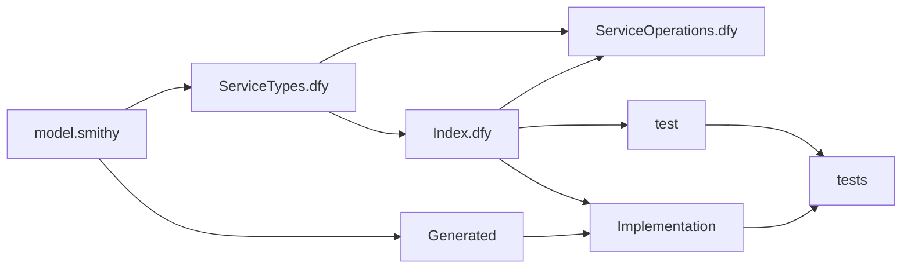

## Overview

Smithy is an interface definition language.
It lets you abstract your interface
from any given executable implementation.
By focusing on the abstract interface
Smithy helps you build an interface
that can safely evolve
maintaining both forward and backwards compatibility.

Dafny is a programming language with formal verification features.
Dafny code is translated to higher-level languages
to provide interoperability for your verified code
like Java or C#.
These native representations are then executable.
This means that a single Dafny program
can be translated into multiple equivalent programs.

Dafny itself has a `string` type
that you might assume can map
to the obvious string type in each translated language.

However a native `string` may be UTF8, UTF16/USC2, or UTF32 
depending on the language.
Numbers are similarly complicated.
Some languages have different sized numbers,
while others have either a different default or a single size.
There are also complicated types like streams.
All these languages have equivalent
but not congruent types to each other.

In this project Dafny and Smithy are combined
to generate concrete interfaces in Dafny
and supported Dafny translation targets.
These generated interfaces all use the same translated Dafny implementation
and expose native interfaces and types for each language.

The Smithy shapes are the common denominator
between all these different types/conversions.

Concretely our traditional greeting program:
`() => "Hello World!"`
generate interfaces that can be used like this:
1. Dafny -> `var hello: seq<char> :- greet();`
1. Java -> `String hello = greet();`
1. C# -> `string hello = greet();`
1. Python -> `hello = greet()`
1. Rust -> `let hello: String = greet();`

## Definitions

- Runtime or native runtime:
    A Dafny translation target language,
    e.g Java or C#.
    This also may include additional context
    like language version or other versions/features.
- Native type or native interface:
    A type/interface in a runtime,
    e.g. Java `String`
- Smithy-runtime:
    The project used to generate native types
    for Smithy shapes.
- Polymorph or polymorph-runtime:
    The transformation layer between Dafny types
    and native types,
    e.g. polymorph-java.
- Shim:
    The object that exports the native interface
    and connects to the internal Dafny implementation.
- Type converters, ToDafny, ToNative:
    The dual functions that convert between
    Dafny and native types.
    e.g. `D == ToDafny(ToNative(D))`,
    `N == ToNative(ToDafny(N))`

### Conventions used in this document

The key words "MUST", "MUST NOT", "REQUIRED", "SHALL", "SHALL NOT", "SHOULD", "SHOULD NOT", "RECOMMENDED", "MAY", and "OPTIONAL"
in this document are to be interpreted as described in [RFC 2119](https://tools.ietf.org/html/rfc2119).

## Smithy-Dafny modes

### Library

`smithy-dafny` supports `@localService` development.
This is where the implementation is locally executing code,
rather than a remote service like most AWS Service Smithy models.

In this mode `smithy-dafny` will produce Dafny types and interfaces
for a Smithy model in Dafny.
This creates an `abstract module` in Dafny you can refine
with a concrete implementation.

`smithy-dafny` also generates polymorph code
that will expose native types and interfaces
for your Smithy model.
This creates a shim with native interfaces.
These native interfaces are connected
to the Dafny interface
and takes care of type conversion back and forth.



The goal is for native developers
to call Dafny libraries with idiomatic types.

### Wrapped AWS Services

`smithy-dafny` also supports creating Dafny AWS Service clients
by wrapping existing native client implementations.

The problem we are trying to solve here is:
I am writing code in Dafny
and I want to call an AWS service,
how do I do that?

In this mode `smithy-dafny` will produce Dafny types and interfaces
so that Dafny code can call the native implementation.

`smithy-dafny` also generates polymorph code
so that these Dafny types and interfaces
are connected to the native interface.
Along with all the required type conversions.

Again there is an `abstract module` that you refine
with a `extern` that returns a native SDK instance
wrapped with the Dafny polymorph shim.
Ideally these `extern` would be generated
but the constructors for the SDKs
are not described in Smithy.

In this diagram we zoom in on
only the Dafny implementation.



The goal is for Dafny developers
to call native AWS SDKs.

### Wrapped Library

`smithy-dafny` can wrap an existing `smithy-dafny` library.
This is useful for integration testing.

When you consider the first two use cases
it is clear that you need tests
to verify that these features are correct.

The first thought is be to write tests in each runtime.
But this is very expensive.
Also keeping track of all these tests across different runtimes is difficult.
You don't want to have tests only in some runtimes but not others.

If you write the tests in Dafny then you only need to write the test once.
But if you natively write these tests in Dafny
when you execute them
they will only test the Dafny code.
Because they will not exercise the type conversions.

So we want to write the tests in Dafny so that they are interoperable
but we need to exercise the native code.
By wrapping the whole project
we force an additional type  conversion.

Writing tests in Dafny means that
your testing is now also interoperable.
A Dafny tests can check multiple runtimes.
But a simple test would only check the Dafny interfaces.

For more details on how this works
see the [polymorph development](#polymorph-development) section blow.

This feature is used to test `smithy-dafny` on itself
in the TestModels.
This features is used by the Encryption SDK
in the test vector runners
to test interoperability between native runtimes.

In this mode `smithy-dafny` will not produce Dafny types and interfaces.
It will use the Dafny types and interfaces that already exist.
It will also create a shim
that will convert the Dafny to native
and then call the native implementation.



The goal is for Dafny developers
to approximate native calls into Dafny libraries.
`smithy-dafny` uses the wrapped library feature
to test the correctness of polymorph-runtime features.

Like this: `var output := ToDafny(ToNative(Work(ToDafny(ToNative(input)))))`

## Polymorph development

When developing `polymorph-X`
the first thing to ask is:
Does `smithy-X` exist?

If it does exist, then
`polymorph-X` SHOULD re-use as much `smithy-X` code-gen as possible, and
`polymorph-X` MUST use the same native types as `smithy-X`.

If it does not exists then look at the AWS SDK in X:
`polymorph-X` SHOULD use the same native types as the native AWS SDK in X runtime.

Regardless `polymorph-X` MUST convert these native types
to the Dafny types produced by `smithy-dafny`.



In this way the dual inputs and output
of the type conversion dual functions are defined.



However there may be many to one relationships.
Perhaps `string` and `char[]`.
These two would convert to `ValidUTF8Bytes` or `seq<uint8>`.

Also reference types may not be exactly equal.
While a native array would convert to a `seq`
when converting back the new array
will have the same elements in the same order
but may not be exactly the same reference object.
We can refer to this as `SemanticallyEqual`.

The spirit of this can be expressed
```dafny
lemma ConversionsCorrectlyInvert<D, N>(ToDafny<D,N>, ToNative<N, D>, SemanticallyEqual)
  ensures forall d, n ::
    SemanticallyEqual(ToNative(d), n) <==> SemanticallyEqual(ToDafny(n), d)
```

Ideally these conversions would be written in Dafny
so such properties could be proven.
Either way we need to test
that these things are true
and that the correct duals are connected together.

It is much easier if we can write our tests in Dafny.
Then we don't need to write new tests for each runtime.
This is where [wrapping a library](#wrapped-library) comes in.

We want the test in Dafny and we want to test the conversions.
by building a project we can control the Dafny implementation.
By wrapping this project we can call it from Dafny
and pass through the type conversions.
This sandwiches the conversions between two functions we control.
Namely, the implementation and the test.
Many of these are already written in the TestModels directory.

For the simple types: string, number, et al
the implementation can not just echo back values.
This is because it is possible that the conversion function
do not produce rational input in the middle.
This is an edge case, but it is easy enough to verify.

Each simple type has smithy operations that:
* returns back what is given.
* only succeed if passed a specific value.
* will only return a constant value

We have one last subtlety to consider.
Since the tests and implementation are both in Dafny
we can clearly see the Dafny representation is reasonable.
But this does not tell us that the native representation is reasonable.

Consider a string.
This string is represented under the hood as bytes
and these bytes have an encoding.
In `smithy-dafny` we represent this string as UTF8 bytes.
If the conversion was to simply change the encoding to USC2
then all our tests would pass.
But looking at the native string it would be drastically different.

This is a degenerate example but should illustrate the point.
At this time we do not have any such degenerate tests written.
This is because maintaining such coverage across multiple runtime
is exceedingly difficult.
It might be that a specification of such tests in conjunction with duvet
might be a possible solution.

## Project Management

Neither Dafny nor `smithy-dafny` provide project management features.
They are not terribly opinionated
about how native project should be set up.

`smithy-dafny` can take a smithy model
and output the generated native code anywhere.
A `runtimes` directory exists in a `smithy-dafny` project
and inside that there is a directory for each native project.

Looking at the TestModels directory you can see examples.
The native project can be set up however is best for the native language.
However the native project needs to bind the following things together

1. `smithy-dafny` generated Polymorph code
1. Translated Dafny implementation code
1. Translated Dafny test code
1. Native `smithy-dafny` dependencies
    * Dafny runtime
    * Dafny conversion libraries
    * Dafny project dependencies
    * Native dependencies - 

In the TestModels directory there is a SharedMakefile
that can be used to provide useful targets for Dafny projects.

Here is an example project structure.



Given the above directory structure,
the dependency flow looks like this.
By dependency flow we mean

* code generated from smithy shapes
* Dafny `import` directives
* Dafny translated code
* dependent Dafny projects


