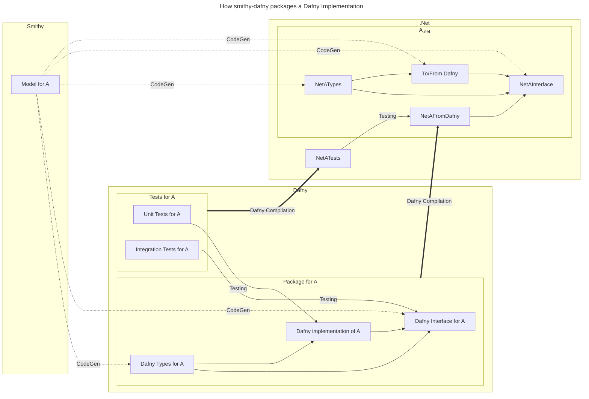
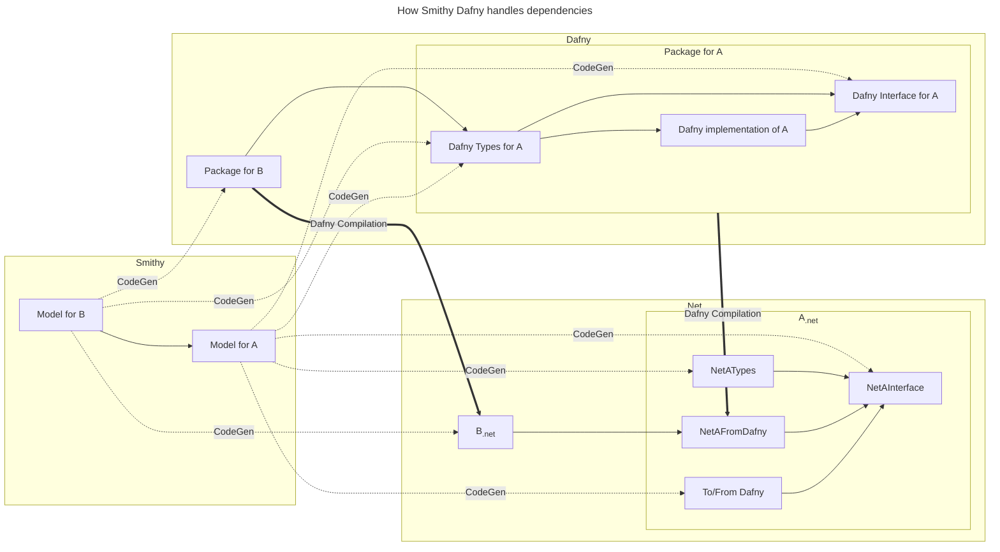
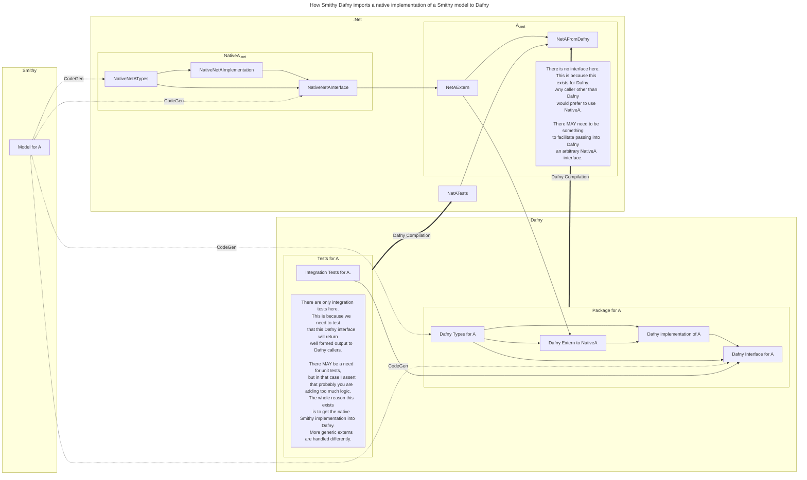
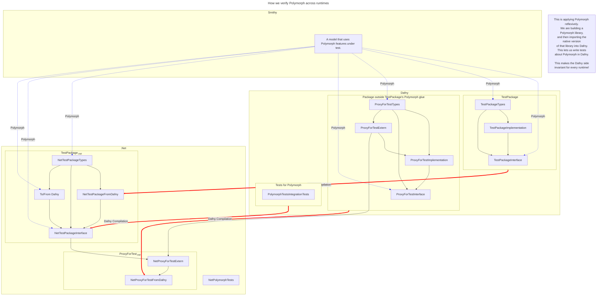

# Detailed design diagrams

These are detailed design diagrams
used to flush out ideas
in smithy-dafny.

## Dependencies

Dependencies are a problem for Dafny
because by default Dafny includes all code
into a single program.
Dafny then translates all this code
into a single program.
This is illustrated in following diagram.
The difficulty here is that when A and C
try and exist in the same environment,
then B symbols will be duplicated. 

However organizing code required packages and dependencies.
Looking at how the AWS Encryption SDK (ESDK)
packages its dependencies
we can see that having duplicate symbols
for the `Crypto` library is problematic.

Now let us return to our first example
and model the dependencies outside the translated program.
In this way when the Dafny is translated
the dependency information is not lost.
This will require coordinating dependencies
between the Dafny and the Native runtime.

## Smithy Dafny

### Library Development

Here is a example of the various components
of smithy dafny fit together to translate a library.

### Dependencies

This is a description of how Smithy Dafny
handles dependencies.

### Wrapped AWS Services

This diagram is about how
smithy-dafny can wrap an existing
application using a smithy model.
This has been specialized
to handle AWS services.

### Extern Library Development

Dafny also allows you to use `extern`
to link to external code.
Linking directly to external code
is complicated.
For the same reason that `smithy-dafny`
exists such types and interfaces
are not fully interoperable.

This is why wrapping the needed external code
inside a library exists.

### Testing/Verification

Coordinating all these types across different runtimes
is a lot of complexity.
It is important to be able to test and reason about this.
This diagram shows how the project relate and compile
to alow for tests in Dafny to exercise
all the type conversions and elements of polymorph.

This diagram takes the components above,
and walks through the testing flow.
Note how the tests start and end in Dafny.

