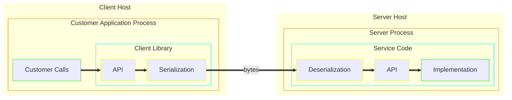
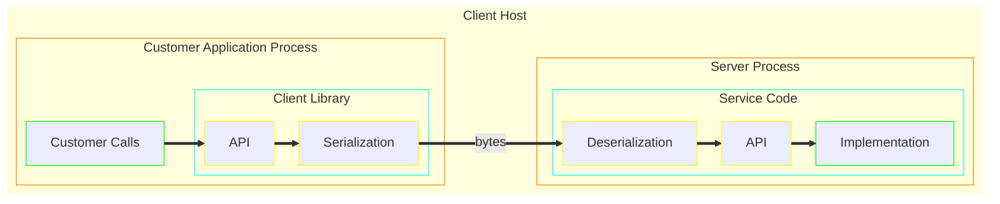
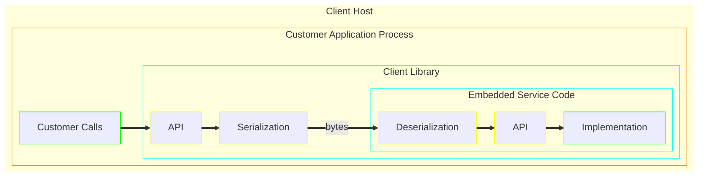

```mermaid
%%{init: {"flowchart": {"defaultRenderer": "elk"}} }%%
flowchart LR
    classDef Process stroke:#f80
    classDef Library stroke:#0ff
    classDef Authored stroke:#0f0
    classDef Generated stroke:#ff0
    classDef Host stroke:#fff
    classDef hidden display: none;

    subgraph ClientHost["Client Host"]
      subgraph CustomerApplicationProcess["Customer Application Process"]
        CustomerCalls["Customer Calls"]:::Authored
        subgraph ClientLibrary["Client Library"]
          ClientAPI["API"]:::Generated ==> Serialization:::Generated
        end
      end
    end
    ClientHost:::Host
    CustomerApplicationProcess:::Process
    ClientLibrary:::Library

    subgraph ServerHost["Server Host"]
      subgraph ServerProcess["Server Process"]
        subgraph ServiceCode["Service Code"]
          Deserialization:::Generated ==> ServerAPI["API"]:::Generated ==> ServerImpl["Implementation"]:::Authored
        end
      end
    end
    ServerHost:::Host
    ServerProcess:::Process
    ServiceCode:::Library

    CustomerCalls ==> ClientAPI
    Serialization == "bytes" ==> Deserialization
```

```mermaid
%%{init: {"flowchart": {"defaultRenderer": "elk"}} }%%
flowchart LR
    classDef Process stroke:#f80
    classDef Library stroke:#0ff
    classDef Authored stroke:#0f0
    classDef Generated stroke:#ff0
    classDef Host stroke:#fff
    classDef hidden display: none;

    subgraph ClientHost["Client Host"]
      subgraph CustomerApplicationProcess["Customer Application Process"]
        CustomerCalls["Customer Calls"]:::Authored
        subgraph ClientLibrary["Client Library"]
          ClientAPI["API"]:::Generated ==> Serialization:::Generated
        end
      end
      subgraph ServerProcess["Server Process"]
        subgraph ServiceCode["Service Code"]
          Deserialization:::Generated ==> ServerAPI["API"]:::Generated ==> ServerImpl["Implementation"]:::Authored
        end
      end
    end
    ClientHost:::Host
    CustomerApplicationProcess:::Process
    ServerProcess:::Process
    ClientLibrary:::Library
    ServiceCode:::Library

    CustomerCalls ==> ClientAPI
    Serialization == "bytes" ==> Deserialization
```

```mermaid
%%{init: {"flowchart": {"defaultRenderer": "elk"}} }%%
flowchart LR
    classDef Process stroke:#f80
    classDef Library stroke:#0ff
    classDef Authored stroke:#0f0
    classDef Generated stroke:#ff0
    classDef Host stroke:#fff
    classDef hidden display: none;

    subgraph ClientHost["Client Host"]
      subgraph CustomerApplicationProcess["Customer Application Process"]
        CustomerCalls["Customer Calls"]:::Authored
        subgraph ClientLibrary["Client Library"]
          subgraph EmbeddedServiceCode["Embedded Service Code"]
            Deserialization:::Generated ==> ServerAPI["API"]:::Generated ==> ServerImpl["Implementation"]:::Authored
          end

          ClientAPI["API"]:::Generated ==> Serialization:::Generated
        end
      end
    end
    ClientHost:::Host
    CustomerApplicationProcess:::Process
    ClientLibrary:::Library
    EmbeddedServiceCode:::Library

    CustomerCalls ==> ClientAPI
    Serialization == "bytes" ==> Deserialization
```